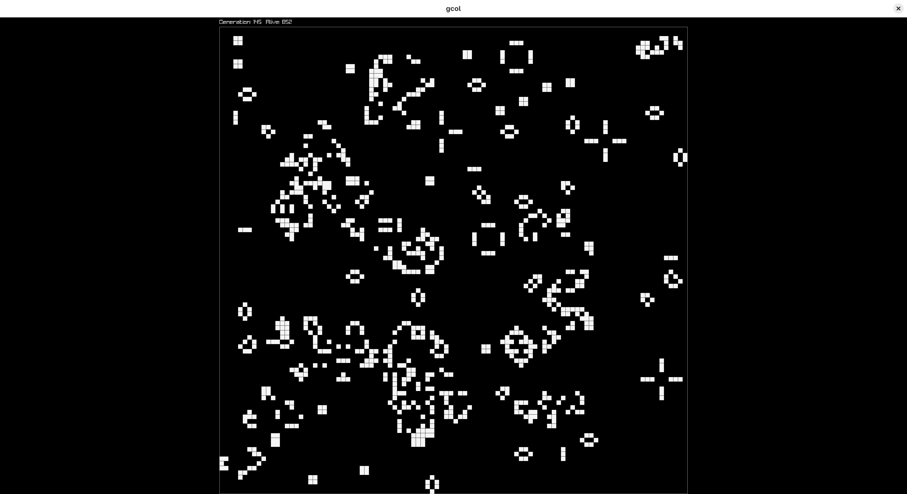

# cgol

[Conway's Game of Life](https://en.wikipedia.org/wiki/Conway's_Game_of_Life) using [Raylib](https://www.raylib.com).

This is a tiny project. I didn't want to vendor anything so install `raylib-devel`.

There is a lot of things still to be done, like using [hashlife](https://en.wikipedia.org/wiki/Hashlife) or do a toroidal grids.
